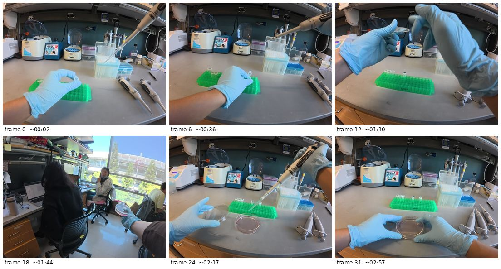

# Closing the frontier-VLM gap on wet-lab Protocol Alignment

Frontier VLMs cannot yet watch a lab video and faithfully reconstruct what happened. On **Protocol Alignment** in LabSuperVision (Cong et al. 2025, [arXiv:2510.14861](https://arxiv.org/abs/2510.14861)) — a benchmark of ~200 egocentric lab videos — GPT-4o, Gemini 2.5 Pro, and Qwen2.5-VL-7B all score 2.0–2.86 / 5; only LabOS's in-house 235B VLM closes the gap. This project builds a system that meaningfully beats the strongest frontier baseline on that metric.

---

## The task: Protocol Alignment on LabSuperVision

**LabSuperVision (LSV)** is a corpus of ~200 egocentric lab videos collected by 7 researchers via head-mounted cameras and smart glasses while running real wet-bio experiments — PCR setup, transformations, CRISPR/Cas9 delivery, gel electrophoresis, etc. Each video is paired with an expert-authored **gold-standard protocol** (the textual SOP that should describe what the researcher did).

**Protocol Alignment** asks: *given the video, can a model produce a stepwise protocol that matches the gold?* Concretely:

> **Input:** a sequence of frames sampled from one experimental session.
> **Output:** numbered, free-form text describing what was performed, with reagents, volumes, durations, equipment.
> **Score:** 0–5, judged against the gold protocol.

Every base model (GPT-5.5, Gemini 2.5 Pro, etc.) in this project receives the **identical prompt** and **identical 32-frame budget**, then writes a stepwise protocol in their own voice. The judge compares predicted vs. gold text and produces structured scores.

### A concrete example (slice `DJI-013`, ~3 min CRISPR/Cas9 delivery)

The model is shown 32 uniformly-sampled frames like these (6 of 32 shown):



**Gold protocol** (what an expert wrote for this experiment):

```
1. Add 1 mL Opti-MEM into a sterile 1.5 mL EP tube.
2. Add Cas9 plasmid.
3. Add guide RNA plasmid.
4. Add PEI (4:1 ratio to DNA).
5. Incubate at room temperature for 20 min.
6. Add the mixture dropwise into a 10 cm dish of 293T cells (~70-80% confluency).
7. Gently rock the dish forward and backward to mix.
8. Place the dish back into the cell incubator (37°C, 5% CO₂).
```

**What GPT-5.5 produced (first 4 of 13 steps; composite 2.0/5):**

```
1. Arrange labeled microcentrifuge tubes in a green tube rack on the lab bench and open the caps of the tubes to be used.
2. Attach a disposable pipette tip to a Transferpette S adjustable micropipette from the tip box.
3. Pipette liquid reagent into an open labeled microcentrifuge tube held in the gloved hand.
4. Place the filled microcentrifuge tube back into the green rack with the cap open.
```

**What Gemini 2.5 Pro produced (first 4 of 9 steps; composite 2.2/5):**

```
1. Place several microcentrifuge tubes into a green tube rack and open their caps.
2. Using a Transferpette S micropipette, transfer a liquid into the open microcentrifuge tubes.
3. Using a second, smaller-volume micropipette, transfer another liquid into the microcentrifuge tubes.
4. Close the caps of the microcentrifuge tubes.
```

Both predictions describe physical actions correctly but neither identifies that the liquids are **Opti-MEM**, **Cas9 plasmid**, **gRNA plasmid**, or **PEI**, nor that the dish contains **293T cells at 70–80% confluency** — they cannot read bottle labels, infer reagent identity from color/state, or recover any numerical parameter (1 mL, 4:1 ratio, 20 min, 37°C). This pattern repeats across all 50 videos and is the central finding of Phase 1 (`parameter_accuracy ≈ 1/5`).

---

## How we measure goodness: the rubric

We score every prediction on a **5-dimension rubric**, each dimension 0–5, with a composite mean. The full anchored rubric is at `eval/prompts/rubric.txt`; the dimensions are:

| Dimension              | What it asks                                                                                  | High score means                                          |
| ---------------------- | --------------------------------------------------------------------------------------------- | --------------------------------------------------------- |
| `step_coverage`        | Of the gold steps, how many appear in the prediction? *(recall)*                              | All gold steps captured                                   |
| `step_hallucination`   | Of the predicted steps, how many are spurious vs. mapping to a gold step? *(precision)*       | Few hallucinated/fabricated steps                         |
| `ordering`             | Are captured steps in the gold's sequence?                                                    | Correct procedural arc                                    |
| `parameter_accuracy`   | Volumes, durations, temperatures, equipment, reagent names — match the gold?                  | Specific values right                                     |
| `granularity_match`    | Is the level of decomposition similar to gold? Not too coarse, not too fine.                  | Same step density as gold                                 |

Each dimension has explicit 0/1/2/3/4/5 anchors (e.g. *step_coverage = 4 means "one gold step missing or merged"*). The judge (Claude Opus 4.7, text-only — does not see the video) returns structured JSON; reasoning per-dimension is logged for auditing. The rubric is a single defensible operationalization of "is the predicted protocol a faithful reconstruction of what happened" — not the only one possible, but ours is published and the prompt template is part of the cache key, so any change auto-invalidates old scores.

---

## Goals (Q1)

**North Star:** beat the strongest zero-shot frontier baseline on Protocol Alignment (LSV bench slice), measured by the 5-dimension rubric above.

**The bet:** a compound system, not a fine-tuned monolith. Specifically:

- **Small perception models trained on FineBio** ([arXiv:2402.00293](https://arxiv.org/abs/2402.00293)) — 14.5 h of hierarchically-annotated wet-bio video with bounding boxes, hand-object states, atomic operations, and step labels. FineBio publishes four pre-trained baselines, three of which look directly useful for our bottleneck:
  - **Object detection (DINO, 56.1 AP / 78.5 AP50)** — detects 35 lab objects per frame (pipettes, tubes, racks, centrifuge, vortex mixer, magnetic rack, etc.). Tells the reasoner "right hand holds a blue pipette over a micro tube" without the reasoner having to see it.
  - **Atomic operation detection (ActionFormer, 34.1 mAP avg)** — predicts structured `(verb, manipulated_object, affected_object)` tuples like `(insert, blue_pipette, micro_tube)`. Most directly useful for protocol generation: gives the reasoner pre-parsed action atoms instead of raw frames.
  - **Step segmentation (MS-TCN++, 97% F1@10)** — temporal grounding: which of 32 step categories is happening at each frame. Used for chunking long videos into protocol-sized units.
  - *(Skipping for now: manipulated/affected object detection — FineBio's hardest task at only 6–22% AP, currently the weakest perception primitive.)*
- **An LLM reasoner** (frontier — GPT-5.5, Gemini, etc.) consumes those structured outputs and constructs the protocol prose. The reasoner doesn't have to *see* labels on bottles; the perception model has already labeled what's there.
- **Post-training the reasoner to use the perception tools well.** A frontier LLM given detections + atomic-operation tuples + step segments isn't guaranteed to use them effectively zero-shot. SFT or RL on synthetic (perception trace → correct protocol) pairs may be needed to teach the reasoner *when* and *how* to invoke each perception primitive, weight conflicting signals, and avoid over-reliance on tool calls that come back uncertain.

A FineBio gap worth naming: their object vocabulary is generic equipment ("micro tube", "blue pipette") — not branded reagents like Opti-MEM or PEI. Closing the parameter_accuracy gap fully may need a separate reagent/label-reading head (OCR + lab-vocabulary prior), trained on whatever labelled-equipment data we can scrape from LSV + JoVE.

The thesis: **the bottleneck is perception, not reasoning** (Phase 1 results below support this). Frontier reasoners are already strong at constructing protocol prose given the right facts; what they cannot do is *see* "this bottle is labeled Opti-MEM." Outsourcing perception to a small specialized model and post-training the reasoner to consume it should close the gap more cheaply than a 235B-parameter monolithic VLM.

Three sub-questions structure the work along the way:

1. **Where does the frontier actually break?** Build a structured failure taxonomy across protocol types and rubric dimensions. *(Answered by Phase 1, see results.)*
2. **What signal actually matters?** Ablate across modalities (object detection, step segmentation, audio, frame budget) and post-training regimes (zero-shot tool use, SFT on perception traces, RL).
3. **What does utility look like beyond the rubric?** Show outputs to 2–3 wet-lab scientists on procedures from their own work; collect qualitative signal where the benchmark and human judgment diverge.

---

## Experiments and success criteria (Q2)

### Done — Phase 1: zero-shot baselines on LSV bench-50

A reproducible zero-shot harness over GPT-5.5 and Gemini 2.5 Pro on a curated 50-video slice of LSV.

**How the eval was constructed:**

- Filter LSV to `Scene == "bench"` clips with associated protocol text (142 candidates across XMglass / DJI / Multiview).
- Sample 50 deterministically (`seed=42`), stratified 20 / 20 / 10 across the three camera setups, deduplicating Multiview's time-aligned multi-phone clips so different *experimental moments* — not different camera angles of the same moment — get sampled.
- 18 distinct Operations represented (PCR, transformation, Cas9 delivery, E-gel loading, serial dilution, etc.).
- Manifest is frozen at `runs/manifests/bench_50_seed42.json`.

**Results** (judge: `claude-opus-4-7`, n = 50 per model):

| Model            | step_coverage | step_hallucination | ordering    | parameter_accuracy | granularity_match | **composite** |
| ---------------- | ------------- | ------------------ | ----------- | ------------------ | ----------------- | ------------- |
| gemini-2.5-pro   | 2.50 ± 1.16   | **2.90 ± 1.20**    | 3.84 ± 1.22 | 1.06 ± 0.89        | **2.92 ± 0.88**   | **2.64 ± 0.84** |
| gpt-5.5          | 2.64 ± 1.05   | 1.90 ± 0.89        | 3.70 ± 1.15 | 0.92 ± 0.90        | 2.14 ± 0.53       | 2.26 ± 0.72   |

**Key finding: parameter_accuracy ≈ 1 / 5 across both models.** Both frontier VLMs cannot read bottle labels, identify reagents from frames, or recover specific volumes/durations — but they get ordering ~3.7+/5, meaning the procedural reasoning is intact when they *can* identify what is happening. The bottleneck is perception, specifically of named entities and numerical parameters. This directly motivates the FineBio-perception bet. Full analysis at `readings/results.md`.

**Success criterion (Phase 1):** ≥ 3 named failure modes tied to a rubric dimension and supported by ≥ 5 example slices. ✅ Met — see `readings/results.md` §3–§4 (parameter blindness, GPT over-decomposition, mutual hallucination).

### Next — testing the compound-system bet

With perception, specifically of named entities and parameters, isolated as the bottleneck, the natural next step is to build a small perception layer using FineBio's annotations and feed it into a frontier reasoner. The interesting questions, in roughly the order I expect to encounter them:

- **Does the perception signal help at all?** Wrap FineBio-trained object detection and step segmentation as tool calls; let a frontier LLM consume them zero-shot and rewrite the protocol. If parameter_accuracy moves from ~1/5 to 2-3/5 with no other changes, that's strong evidence the bottleneck framing is correct.
- **Does the reasoner actually know how to use these tools?** Frontier LLMs given a tool-use harness aren't guaranteed to invoke it well — they may over-call, under-call, or trust uncertain detections. If naive zero-shot under-performs, post-training the reasoner (SFT or RL on synthetic perception-trace → gold-protocol pairs) becomes the lever.
- **Which signals are worth the cost?** Ablations on whichever system works: detections on/off, step segmentation on/off, frame budget, audio narration via Whisper. The point is not just to win on composite but to know *which* signal is doing the work.
- **Does the rubric miss something humans care about?** Show the best system's outputs to 2-3 wet-lab scientists on procedures from their own work and listen for what the rubric isn't capturing.

**Overall success criterion:** the best compound system beats the strongest Phase 1 baseline by ≥ 0.3 on composite, with the gain explained by the dimensions Phase 1 identified as the gap (parameter_accuracy and step_coverage). Failing that, the project still has value if the failure is informative — e.g. "tool-use alone wasn't enough, here's the post-training recipe needed" or "frontier reasoners can't be coerced to use external perception, the LabOS approach of training one big model is the right shape."

---

## Methodology (brief)

- **Generators:** GPT-5.5, Gemini 2.5 Pro. Identical prompt template, 32 uniform frames at 1024px, audio stripped, temperature 0.
- **Judge:** Claude Opus 4.7, text-only — sees predicted + gold protocol text only, *not* the video. Avoids same-family multimodal confound.
- **Rubric:** 5 dimensions × 0–5, anchored, published at `eval/prompts/rubric.txt`. Composite = mean.
- **Caching:** every prediction and score keyed on `(model, slice_id, prompt_hash, frame_count)`. Reruns of unchanged inputs are free.
- **Modular:** adding a new generator is one file under `eval/generators/`; new judge under `eval/judge/`. Intentionally swappable for fine-tuned variants.

The LabOS paper has notable methodological gaps (undisclosed inference recipe, unpublished judge prompt, undisclosed split, metric switching between tables). This harness commits to fully published choices so our numbers are reproducible.

---

## Repo layout

```
data/lsv/                         # symlink to LSV dataset (gitignored)
readings/                         # paper distillations + results writeup
  LabOS.md                        # source paper + LSV benchmark
  FineBio.md                      # closest sibling dataset (perception-only)
  results.md                      # Phase 1 analysis (read this for the findings)
eval/
  manifest.py                     # build the 50-video manifest
  frames.py                       # uniform frame extraction (ffmpeg)
  generators/                     # ProtocolGenerator ABC + OpenAI + Gemini
  judge/                          # ProtocolJudge ABC + Claude
  prompts/
    generation.txt                # shared prompt for all generators
    rubric.txt                    # judge rubric with 0–5 anchors
  run.py                          # generation entry point (--shard i/n)
  score.py                        # scoring entry point
  report.py                       # aggregate report
scripts/
  eval_lsv.sbatch                 # 4-task SLURM array (cpu partition)
  eval_lsv_score.sbatch           # scoring-only sbatch
  eval_lsv_gemini.sbatch          # gemini gen+score+report
  submit_eval.sh                  # convenience wrapper
  progress.sh                     # one-shot status snapshot
  download_lsv.py                 # resilient HF dataset downloader
tests/                            # pytest harness for non-API components
runs/                             # all eval outputs, gitignored
  manifests/bench_50_seed42.json
  predictions/{model}/{slice_id}__{hash}.json
  scores/{judge}/{model}/{slice_id}__{hash}.json
  frames/{slice_id}/*.jpg
  slurm_logs/
  report.md                       # final aggregate
```

## Running

```bash
cp .env.example .env             # fill in 3 API keys (OpenAI, Google, Anthropic)
pip install -r requirements.txt
python -m eval.manifest          # builds runs/manifests/bench_50_seed42.json
pytest tests/ -v                 # 11 tests, all non-API
bash scripts/submit_eval.sh      # full eval on cluster
bash scripts/progress.sh         # status snapshot anytime
```

Smoke test (1 video, ~$0.50):

```bash
python -m eval.run --models gpt-5.5 gemini-2.5-pro --limit 1
python -m eval.score --judge claude-opus-4-7 --models gpt-5.5 gemini-2.5-pro --limit 1
```

## References

- LabOS paper (LSV benchmark): [arXiv:2510.14861](https://arxiv.org/abs/2510.14861)
- LSV dataset: [labos1/LSV on Hugging Face](https://huggingface.co/datasets/labos1/LSV) (CC-BY-NC-4.0)
- FineBio paper (sibling perception dataset): [arXiv:2402.00293](https://arxiv.org/abs/2402.00293)
- Phase 1 results writeup: `readings/results.md`
